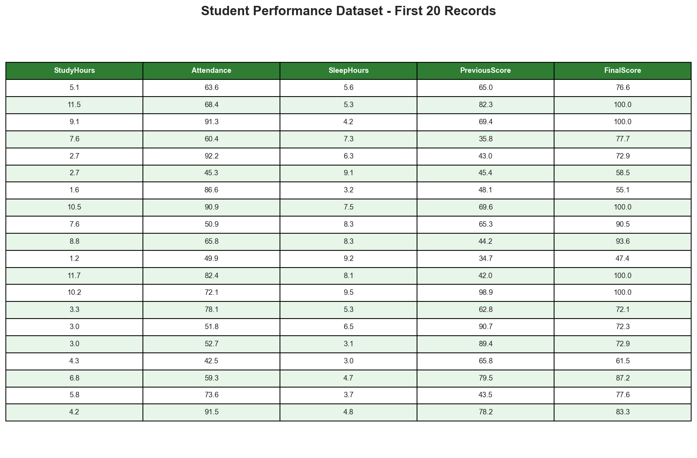
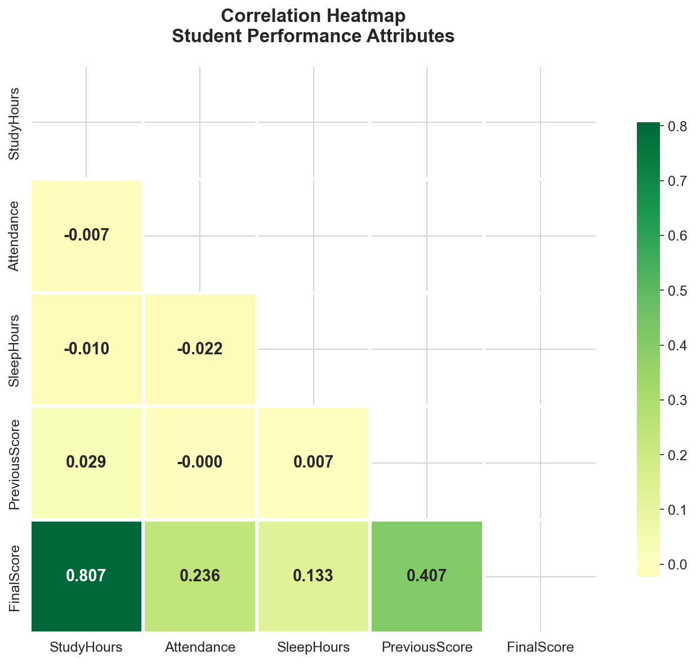
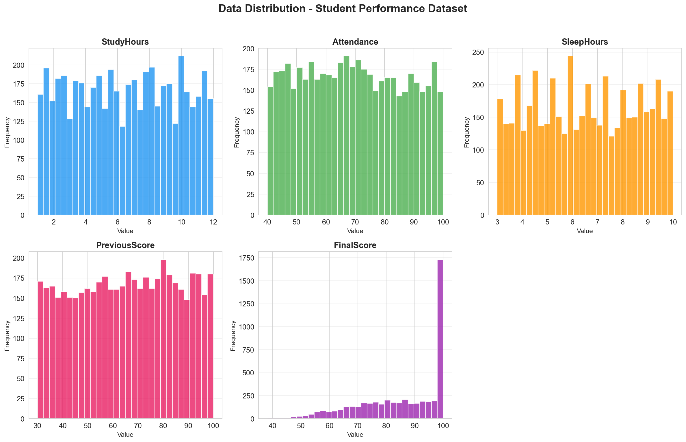
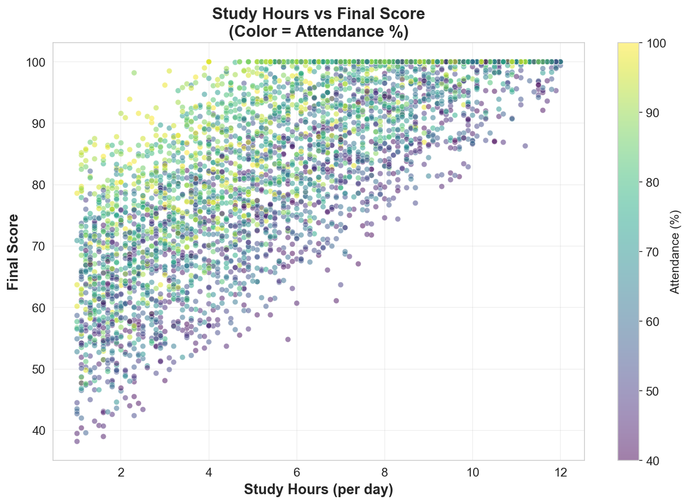
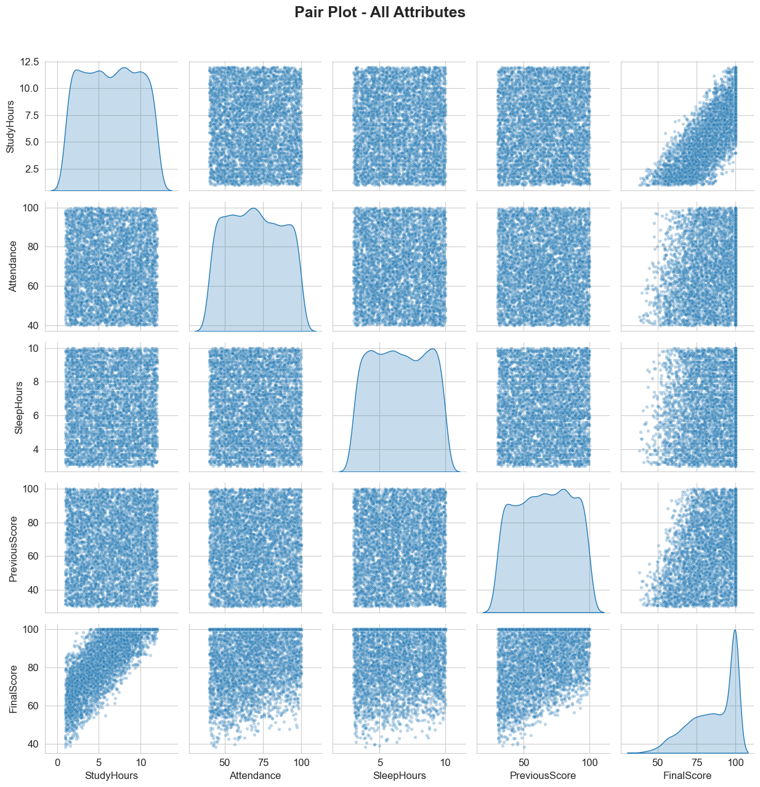
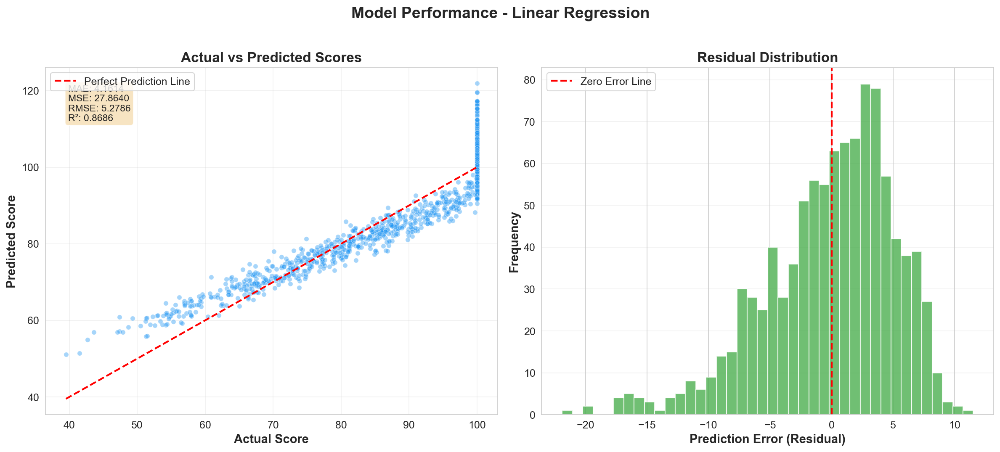

<div align="center">

# 🎓 Student Performance Prediction System

### *AI-Powered Academic Score Forecasting using Machine Learning*

[](https://python.org)
[](https://scikit-learn.org)
[](https://flask.palletsprojects.com)
[](https://pandas.pydata.org)
[](./LICENSE)

<br/>

> A comprehensive machine learning project that predicts student academic performance by analyzing study behavior, attendance patterns, sleep habits, and academic history. Built with a **Flask-powered interactive dashboard** for real-time predictions.

<br/>

[📊 View Demo](https://drive.google.com/file/d/14u-KCd0DjNAihxM0ihI4wBjwtwGR28_4/view?usp=sharing) · [📄 Project Report](https://drive.google.com/file/d/1HIvcz8c1k3Tp_m6jebxMSZkSsnJrq3pV/view?usp=sharing) · [📸 Screenshots](https://drive.google.com/drive/folders/1vjuhBp7Fdmh2Grdo2a2IB7UAucdL7-QY?usp=sharing) · [📁 Google Drive](https://drive.google.com/drive/folders/1LXHH_WXzhN3mZVWCYCBp9siPvk5owXat?usp=sharing)

</div>

---

## 📋 Table of Contents

- [Overview](#-overview)
- [Features](#-features)
- [Project Structure](#-project-structure)
- [Dataset](#-dataset)
- [Algorithm](#-algorithm-used)
- [Tech Stack](#-tech-stack)
- [Installation & Setup](#-installation--setup)
- [Flask Web Dashboard](#-flask-web-dashboard)
- [Screenshots](#-screenshots)
- [Performance Metrics](#-performance-metrics)
- [API Endpoints](#-api-endpoints)
- [Links & Resources](#-links--resources)
- [Author](#-author)

---

## 🔍 Overview

The **Student Performance Prediction System** is a machine learning-based application designed to forecast student final exam scores. By leveraging **Linear Regression**, the system analyzes key academic and behavioral features — including study hours, attendance percentage, sleep duration, and previous scores — to deliver accurate performance predictions.

The project includes:
- 📓 A **Jupyter Notebook** with end-to-end data analysis and model training
- 🐍 A **standalone Python script** for quick predictions
- 🌐 A **Flask web dashboard** with interactive charts and real-time prediction

---

## ✨ Features

| Feature | Description |
|---------|-------------|
| 🧹 **Data Cleaning & Preprocessing** | Handles missing values, duplicates, and data normalization |
| 📊 **Exploratory Data Analysis (EDA)** | Comprehensive visualizations including scatter plots, heatmaps, histograms, and pair plots |
| 🤖 **ML Model Training** | Linear Regression model trained on 5,000 student records |
| 🎯 **Real-time Prediction** | Predict student scores instantly via the web dashboard |
| 📉 **Model Evaluation** | Performance metrics — MAE, MSE, RMSE, R² Score |
| 🌐 **Interactive Web Dashboard** | Flask-based UI with charts, data explorer, and prediction form |
| 📈 **Feature Importance** | Visualize which factors most influence student performance |
| 🔄 **Actual vs Predicted** | Compare model predictions against real scores |
| 📊 **Residual Analysis** | Analyze prediction error distribution |

---

## 📁 Project Structure

```
Student_Performance_Prediction_System/
│
├── 📂 dataset/
│   └── student_performance_dataset.csv       # Dataset with 5,000 student records
│
├── 📂 notebook/
│   └── student_performance_prediction.ipynb  # Jupyter Notebook (full analysis + model)
│
├── 📂 source_code/
│   └── main.py                               # Standalone Python prediction script
│
├── 📂 flask_app/
│   ├── app.py                                # Flask backend with ML model & API
│   ├── 📂 templates/
│   │   └── index.html                        # Dashboard UI template
│   └── 📂 static/
│       ├── 📂 css/
│       │   └── style.css                     # Dashboard styling
│       └── 📂 js/
│           └── main.js                       # Dashboard interactivity & charts
│
├── 📂 screenshots/
│   ├── dataset_output.png                    # Dataset preview
│   ├── heatmap.png                           # Correlation heatmap
│   ├── histograms.png                        # Feature distributions
│   ├── pairplot.png                          # Pair plot analysis
│   ├── prediction_result.png                 # Prediction output
│   └── scatterplot.png                       # Study hours vs final score
│
├── 📂 demo/
│   └── Video.mp4                             # Project demonstration video
│
├── 📂 documentation/
│   ├── Project_Report.md                     # Project report (Markdown)
│   └── Project_Report.pdf                    # Project report (PDF)
│
├── links.txt                                 # External resource links
├── requirements.txt                          # Python dependencies
└── README.md                                 # This file
```

---

## 📊 Dataset

The dataset contains **5,000 student records** with the following attributes:

| # | Attribute | Type | Description | Range |
|---|-----------|------|-------------|-------|
| 1 | `StudyHours` | Float | Number of study hours per day | 0 – 24 |
| 2 | `Attendance` | Float | Student attendance percentage | 0 – 100% |
| 3 | `SleepHours` | Float | Average sleep hours per day | 0 – 12 |
| 4 | `PreviousScore` | Float | Previous examination score | 0 – 100 |
| 5 | `FinalScore` | Float | Final predicted score *(Target)* | 0 – 100 |

---

## 🧠 Algorithm Used

### Linear Regression

**Linear Regression** is a supervised machine learning algorithm used for predicting continuous numerical values. It models the relationship between dependent and independent variables by fitting a linear equation:

```
FinalScore = β₀ + β₁(StudyHours) + β₂(Attendance) + β₃(SleepHours) + β₄(PreviousScore)
```

Where:
- `β₀` = Intercept
- `β₁, β₂, β₃, β₄` = Learned coefficients (feature weights)

The model minimizes the **Mean Squared Error (MSE)** between predicted and actual values using the Ordinary Least Squares (OLS) method.

---

## 🛠 Tech Stack

| Category | Technology |
|----------|-----------|
| **Language** | Python 3.8+ |
| **Data Processing** | Pandas, NumPy |
| **Visualization** | Matplotlib, Seaborn |
| **Machine Learning** | Scikit-learn (Linear Regression) |
| **Web Framework** | Flask |
| **Frontend** | HTML5, CSS3, JavaScript |
| **Notebook** | Jupyter Notebook |

---

## 🚀 Installation & Setup

### Prerequisites
- Python 3.8 or higher
- pip (Python package manager)

### Step 1: Clone the Repository
```bash
git clone https://github.com/sbharathkrishnan28/Bharath_Krishnan_S_JrAIML_Suprazo.git
cd "Bharath_Krishnan_S_JrAIML_Suprazo/student prediction system"
```

### Step 2: Install Dependencies
```bash
pip install -r requirements.txt
```

### Step 3: Choose How to Run

<details>
<summary>🌐 <b>Option 1: Flask Web Dashboard (Recommended)</b></summary>
<br/>

```bash
pip install flask
cd flask_app
python app.py
```
Open your browser and navigate to: `http://localhost:5000`

</details>

<details>
<summary>📓 <b>Option 2: Jupyter Notebook</b></summary>
<br/>

```bash
jupyter notebook notebook/student_performance_prediction.ipynb
```

</details>

<details>
<summary>🐍 <b>Option 3: Python Script</b></summary>
<br/>

```bash
python source_code/main.py
```

</details>

<details>
<summary>☁️ <b>Option 4: Google Colab</b></summary>
<br/>

Upload the notebook (`notebook/student_performance_prediction.ipynb`) and dataset (`dataset/student_performance_dataset.csv`) to [Google Colab](https://colab.research.google.com/) and run all cells.

</details>

---

## 🌐 Flask Web Dashboard

The project includes a fully interactive **Flask-powered web dashboard** that provides:

- **📊 Dashboard Overview** — Dataset statistics, model metrics, and correlation matrix
- **🎯 Prediction Engine** — Enter student details and get instant score predictions with performance level classification
- **📈 Interactive Charts** — Scatter plots, distribution charts, actual vs predicted comparisons, residual analysis, and feature importance
- **📋 Data Explorer** — Browse, search, and paginate through the complete dataset

### Performance Levels

| Predicted Score | Level | Indicator |
|----------------|-------|-----------|
| ≥ 90 | 🟢 Excellent | Top performer |
| 75 – 89 | 🔵 Good | Above average |
| 60 – 74 | 🟡 Average | Meets expectations |
| < 60 | 🔴 Needs Improvement | Requires attention |

---

## 📸 Screenshots

<div align="center">

### Dataset Preview


<br/><br/>

### Correlation Heatmap


<br/><br/>

### Feature Distributions


<br/><br/>

### Study Hours vs Final Score


<br/><br/>

### Pair Plot Analysis


<br/><br/>

### Prediction Result


</div>

---

## 📈 Performance Metrics

| Metric | Description | Formula |
|--------|-------------|---------|
| **MAE** | Mean Absolute Error — Average magnitude of prediction errors | `Σ|yᵢ - ŷᵢ| / n` |
| **MSE** | Mean Squared Error — Average of squared prediction errors | `Σ(yᵢ - ŷᵢ)² / n` |
| **RMSE** | Root Mean Squared Error — Square root of MSE | `√MSE` |
| **R² Score** | Coefficient of Determination — Proportion of variance explained by the model | `1 - (SS_res / SS_tot)` |

---

## 🔌 API Endpoints

The Flask app exposes the following RESTful API endpoints:

| Method | Endpoint | Description |
|--------|----------|-------------|
| `GET` | `/` | Main dashboard page |
| `GET` | `/api/stats` | Dataset statistics & model metrics |
| `GET` | `/api/dataset?page=1&per_page=20` | Paginated dataset with search |
| `POST` | `/api/predict` | Predict student score |
| `GET` | `/api/charts/scatter` | Scatter plot data |
| `GET` | `/api/charts/distribution` | Feature distribution histograms |
| `GET` | `/api/charts/actual_vs_predicted` | Actual vs Predicted comparison |
| `GET` | `/api/charts/residuals` | Residual distribution |
| `GET` | `/api/charts/feature_importance` | Feature importance (coefficients) |

### Example Prediction Request

```bash
curl -X POST http://localhost:5000/api/predict \
  -H "Content-Type: application/json" \
  -d '{
    "study_hours": 7,
    "attendance": 85,
    "sleep_hours": 7,
    "previous_score": 78
  }'
```

### Example Response

```json
{
  "success": true,
  "prediction": 82.45,
  "level": "Good",
  "color": "#3b82f6",
  "contributions": {
    "StudyHours": 19.67,
    "Attendance": 12.50,
    "SleepHours": 3.89,
    "PreviousScore": 46.39,
    "Intercept": 0.0
  }
}
```

---

## 🔗 Links & Resources

| Resource | Link |
|----------|------|
| 📁 **Google Drive (All Files)** | [Open in Drive](https://drive.google.com/drive/folders/1LXHH_WXzhN3mZVWCYCBp9siPvk5owXat?usp=sharing) |
| 📸 **Screenshots** | [View Screenshots](https://drive.google.com/drive/folders/1vjuhBp7Fdmh2Grdo2a2IB7UAucdL7-QY?usp=sharing) |
| 📄 **Project Report (PDF)** | [View Report](https://drive.google.com/file/d/1HIvcz8c1k3Tp_m6jebxMSZkSsnJrq3pV/view?usp=sharing) |
| 🎥 **Demo Video** | [Watch Demo](https://drive.google.com/file/d/14u-KCd0DjNAihxM0ihI4wBjwtwGR28_4/view?usp=sharing) |

---

## 👤 Author

**Bharath Krishnan S**
- 🏢 Suprazo Technologies — Junior AI/ML Intern
- 🔗 GitHub: [@sbharathkrishnan28](https://github.com/sbharathkrishnan28)

---

## 📄 License

This project is developed for **educational and internship purposes** at Suprazo Technologies.

---

<div align="center">

⭐ *If you found this project helpful, give it a star!* ⭐

</div>
